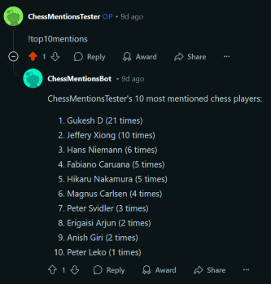

# Reddit Chess Bot

The Reddit Chess Bot lets users discover their top 10 most-mentioned chess players. By commenting "!top10mentions" 
on the r/chess subreddit, users can summon the bot to analyze their submission and comment history. The bot then responds 
with a ranked list of the players mentioned and the frequency of each mention, offering a fun and insightful way to 
reflect on their chess-related discussions.

Reddit Bot Account: https://www.reddit.com/user/ChessMentionsBot/

## How It's Made:

Tech used: Python, SqlAlchemy, Praw, PyTest, PyTest-Mock, Python-DotEnv

To build the database, I started by downloading an XML file from the FIDE website containing all registered chess players. I converted this file into a SQLite database for ease of use. The database solely tracks titled players, who are significantly more likely to be mentioned.

The program runs a continuous stream that monitors Reddit for mentions. When a mention is detected, it scans the user's submission and comment history, analyzing how often each player in the database is referenced.

The bot underwent rigorous testing with unit and integration tests to ensure its responses are accurate and reliable.

Currently, I am in the process of deploying the bot on Amazon Web Services, allowing it to operate 24/7.

## Lessons Learned

This app deepened my understanding of the Model View Controller architecture, as it is the most extensive application of MVC I have undertaken. Organizing the code with MVC made it more modular, maintainable, and easier to test, significantly improving overall development efficiency.

I also gained experience in writing comprehensive unit and integration tests using PyTest and PyTest-Mock. These tests allowed me to update my project more efficiently by ensuring that changes to the code did not introduce any new issues.